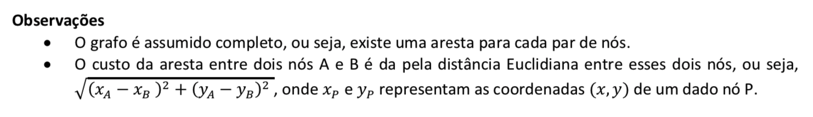

# Roteamento de Veículos utilizando Hill Climbing
> Capacitated vehicle routing problem (CVRP)

## Descrição
O problema de roteamento de veículos capacitados é definido por um conjunto de n nós (representando n-1 clientes e 1 depósito) e a distância entre cada par de nós. Cada cliente possui uma demanda por mercadorias, que são fornecidos pelo depósito. Temos à disposição um conjunto de caminhões (todos de igual capacidade) que podem ser utilizados para entregar as mercadorias.

## Andamento
Como usar algoritmo de exemplo para extracao dos dados
* --file caminho_para_instancia
* --trucks numero_de_caminhoes
* --repetitions numero_de_execucoes_do_algoritmo

```bash
& python3 simple_cvrp.py --file CVRP/eil33.vrp.txt --trucks 4 --repetitions 1000
```

## Objetivo
O objetivo é encontrar um roteamento (que cidades cada caminhão deve visitar e em que ordem) capaz de atender à demanda por mercadorias de todos os clientes sem violar a capacidade dos caminhões, bem como minimizar:

- (i) a quantidade de caminhões utilizados;
- (ii) a soma da distância percorrida por todos os caminhões.

## Instâncias disponíveis
- [att48](CVRP/att48.vrp.txt)
- [eil33](CVRP/eil33.vrp.txt)
- [eilc76](CVRP/eilc76.vrp.txt)



## Formato dos arquivos
Cada linha pode especificar um dos itens abaixo (as linhas):

- Capacidade dos caminhões (linha vermelha).
- Coordenadas de um nó (linhas verdes), cada um definido pela tupla (id, x, y), onde x e y são as
coordenadas do nó identificado por id. O id de número 1 corresponde ao depósito.
- Demanda de um nó (linhas azuis), cada uma definida pela tupla (id, quant), onde quant é a quantidade
(de mercadorias) demandada pelo nó. Novamente, o id 1 corresponde ao depósito.
- Comentários (linhas azuis), que podem ser ignorados.

### Exemplo
```
CAPACITY: 180
NODE_COORD_SECTION
1 40 40
2 22 22
3 36 26
...
DEMAND_SECTION
1 0
2 18
3 26
...
```
